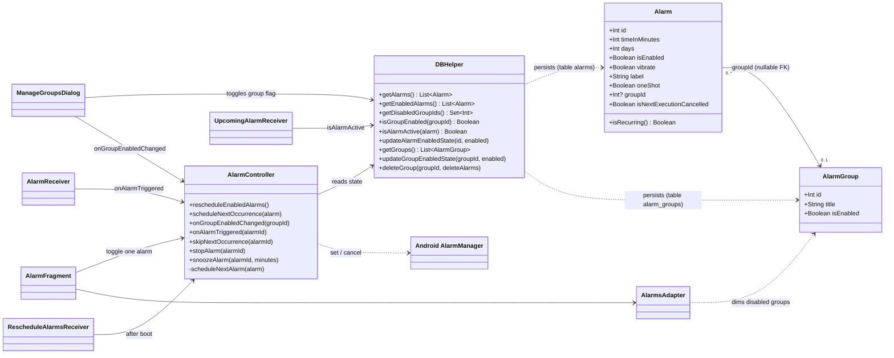

# Class diagram

Mermaid diagrams (render natively on GitHub, or with any Mermaid viewer). Scope: alarms, alarm groups and their scheduling. Routines mirror the same pattern and are omitted for clarity.

## Data model (SQLite)

| Table | Column | Notes |
|---|---|---|
| `alarms` (hasta v1.1.5: `contacts`, nombre heredado erróneo; renombrada en BD v5) | `id`, `time_in_minutes`, `days`, `is_enabled`, `vibrate`, `sound_*`, `label`, `one_shot`, `next_execution_cancelled` | `is_enabled` is the alarm's **own** switch |
| `alarms` | `group_id` | nullable; `NULL` = ungrouped. No SQL foreign key: integrity is kept in code (`deleteGroup`) |
| `alarm_groups` | `id`, `title`, `is_enabled` | `is_enabled` is the group's switch |

## Effective state rule

An alarm rings only if **`alarm.isEnabled` AND its group is enabled** (ungrouped alarms count as enabled).
Toggling a group never modifies the `is_enabled` of its alarms, so re-enabling the group restores each alarm exactly as the user left it. The single source of truth for this rule is `DBHelper.getEnabledAlarms()` / `isAlarmActive()`, plus the guard inside `AlarmController.scheduleNextAlarm()`.
