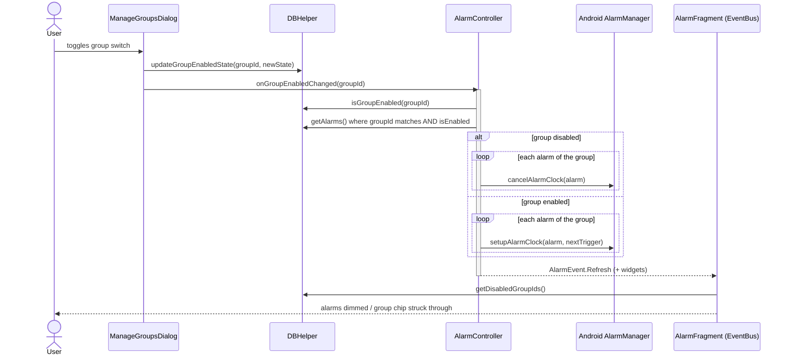
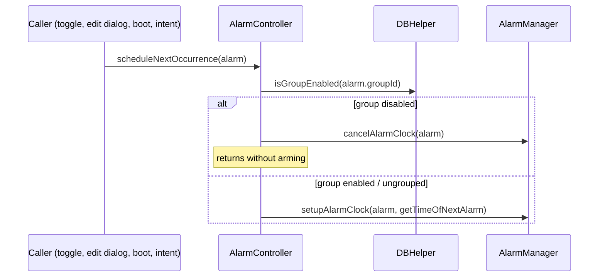
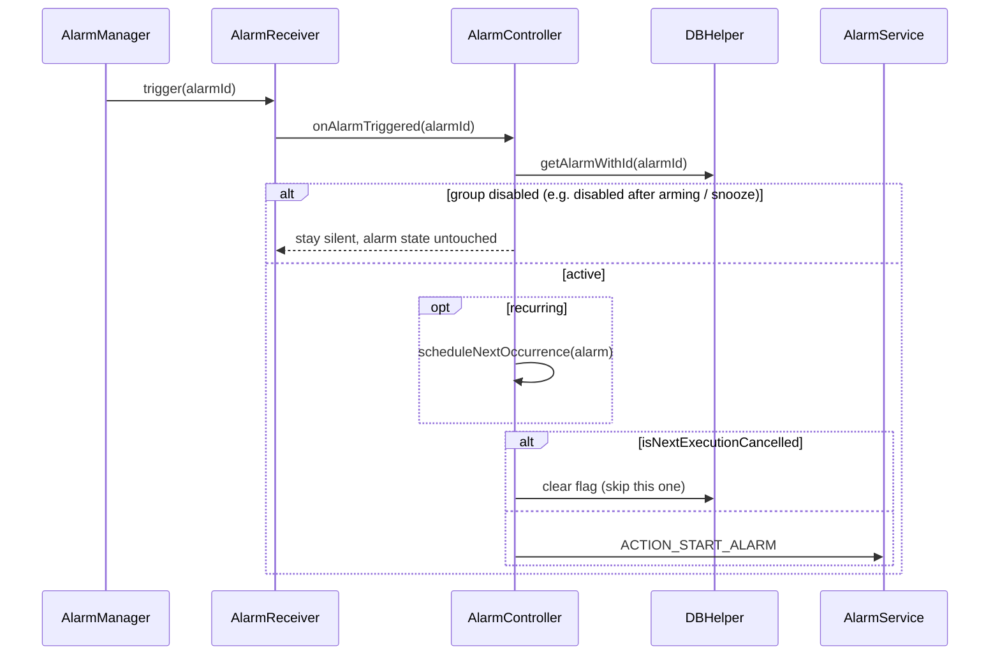
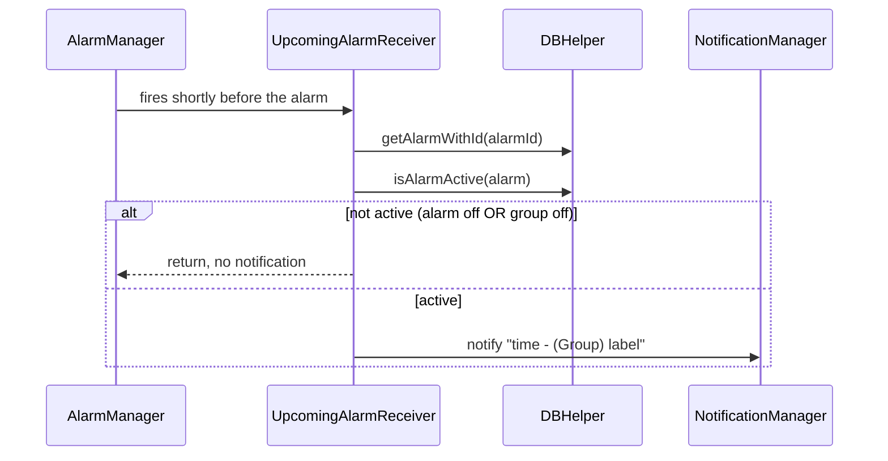

# Sequence diagrams

Mermaid diagrams (render natively on GitHub, or with any Mermaid viewer).

## 1. Disabling / enabling an alarm group (fixed in v1.1.5)

Before v1.1.5 the dialog only called `updateGroupEnabledState` and posted a refresh: the flag was stored but never read by the scheduling code, so alarms kept ringing.

## 2. Scheduling guard (every path that arms an alarm)

## 3. An alarm fires

## 4. Upcoming-alarm notification

